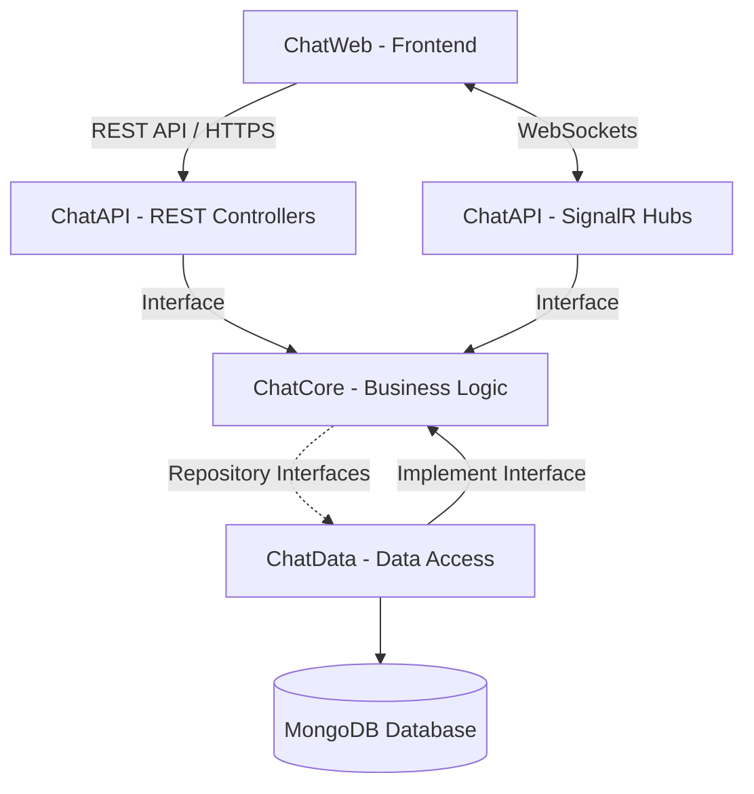
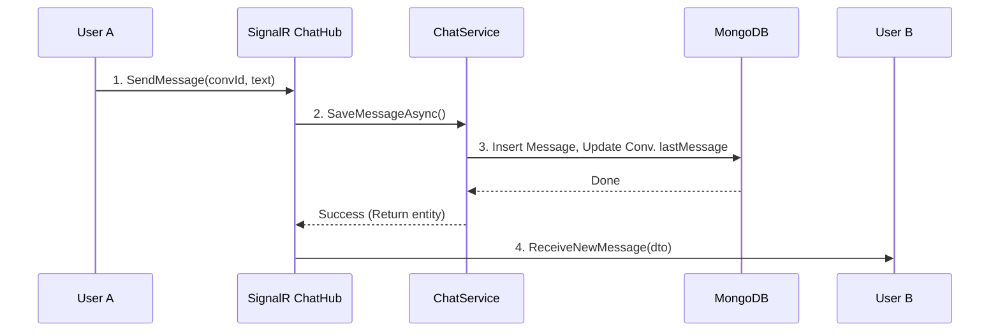

# Thiết Kế Hệ Thống Chat Realtime & Video Call

Tài liệu này mô tả chi tiết kiến trúc và thiết kế cho hệ thống ứng dụng chat realtime hỗ trợ gọi video sử dụng **.NET Core**, **MongoDB**, **SignalR** và **WebRTC**.

## 1. Thiết Kế Cấu Trúc Project

Hệ thống được chia làm 4 layer rành mạch dựa trên mô hình N-Tier:

```text
ChatApp/
├── ChatAPI/ (Presentation Layer)
│   ├── Controllers/     # Nơi nhận HTTP requests (RESTful APIs)
│   ├── Hubs/            # SignalR Hubs (ChatHub, CallHub)
│   ├── Middleware/      # Xử lý Exception, Authentication, Logging
│   └── Program.cs       # Cấu hình DI, Middleware pipeline
├── ChatCore/ (Business Logic Layer)
│   ├── Interfaces/      # Định nghĩa các contracts (IChatService, IUserRepository...)
│   ├── Services/        # Chứa logic nghiệp vụ (ChatService, AuthService)
│   ├── Entities/        # Domain models chuẩn (User, Message, Conversation)
│   ├── DTOs/            # Data Transfer Objects cho việc giao tiếp với Presentation
│   ├── Models/          # Cấu hình, Option models
│   └── Enums/           # Các Enumerations (MessageType, CallStatus...)
├── ChatData/ (Data Access Layer)
│   ├── Context/         # MongoDB Context (chứa MongoClient và IMongoDatabase)
│   ├── Repositories/    # Implement các Interface từ Core (UserRepository, MessageRepository)
│   └── Settings/        # MongoDbSettings (ConnectionString, DatabaseName)
└── ChatWeb/ (Frontend)
    ├── UI/              # Các components giao diện (React/Vue/Angular)
    ├── Services/        # Các API clients gọi đến Backend
    ├── SignalRClient/   # Xử lý kết nối websocket tới ChatHub/CallHub
    └── WebRTC/          # Xử lý luồng Media (Camera, Mic), RTCPeerConnection
```

## 2. Dependency Giữa Các Layer

> [!IMPORTANT]
> **Nguyên tắc phụ thuộc**: Dependency luôn đi từ ngoài vào trong, lớp trên gọi lớp dưới nhưng **không có chiều ngược lại**.

- **ChatAPI** phụ thuộc vào **ChatCore** (để gọi Services) và **ChatData** (chỉ để tiêm Dependency Injection ở `Program.cs`).
- **ChatCore** không phụ thuộc vào bất kỳ layer nào. Mọi interface giao tiếp với Database được định nghĩa ở đây (`IChatRepository`), giúp Business Logic hoàn toàn độc lập với công nghệ DB dưới cùng (ở tầng này ta không tham chiếu đến MongoDB driver).
- **ChatData** phụ thuộc vào **ChatCore** để implement các interfaces truy xuất dữ liệu được định nghĩa ở Core.
- **ChatWeb** phụ thuộc vào **ChatAPI** thông qua HTTP REST và Websocket.

**Sơ đồ Kiến Trúc:**


## 3. Chức Năng Chính

- **Đăng ký / Đăng nhập**: Dùng JWT để xác thực, cấp phát token để duy trì phiên làm việc.
- **Chat Realtime**:
  - Chat 1-1 và Group.
  - Gửi tin nhắn dạng Text, Hình ảnh (Upload qua API riêng lên Cloud), File.
  - Offline/Online: Dựa vào SignalR Connection Lifecycle (`OnConnectedAsync`, `OnDisconnectedAsync`).
  - Typing, Seen: Đẩy sự kiện theo thời gian thực.
- **Gọi Video (WebRTC)**:
  - Khởi tạo P2P Connection giữa 2 user.
  - Signaling (Truyền thông tin SDP, ICE Candidates) qua kênh SignalR.

## 4. Thiết Kế Backend

**ChatCore (Services):**
- `AuthService`: Xử lý băm mật khẩu, cấp phát JWT, xác thực danh tính.
- `ChatService`: Thêm tin nhắn, lấy lịch sử tin nhắn dạng phân trang, lấy danh sách nhóm chat.
- `CallService`: Quản lý trạng thái gọi (người dùng có đang trong cuộc gọi khác không), lưu log cuộc gọi vào Database.

**ChatData (Repositories):**
- `UserRepository`: Các hàm thao tác với `Users` collection trong MongoDB.
- `MessageRepository`: Query và Insert tin nhắn.
- `ConversationRepository`: Cập nhật trạng thái nhóm chat, members.

**ChatAPI (Controllers & Hubs):**
- `AuthController`: Nhận POST request Đăng nhập / Đăng ký.
- `ChatController`: API Get lịch sử trò chuyện (Dùng HTTP thay vì WebSockets để tối ưu lấy lịch sử).
- `ChatHub`: Socket endpoint nhận Message, Typing, Status.
- `CallHub`: Socket endpoint nhận Offer, Answer, IceCandidates cho đàm phán cuộc gọi.

## 5. Thiết Kế MongoDB

Ứng dụng chat đòi hỏi khả năng đọc ghi tốc độ cao với các cấu trúc dữ liệu đa dạng. Schema flexible của MongoDB hoàn toàn tương thích với yêu cầu này.

> [!TIP]
> Sử dụng **Cursor-based Pagination** kết hợp Index phân trang cho Message (chẳng hạn dùng mốc _id hoặc createdAt làm cursor) thay vì `Skip() Limit()`.

### A. Lược đồ JSON (Mẫu)

**1. Users Collection**
```json
{
  "_id": "ObjectId",
  "username": "john_doe",
  "passwordHash": "$2ax$...",
  "displayName": "John Doe",
  "avatarUrl": "https://...",
  "lastOnline": "2024-03-31T00:00:00Z",
  "isOnline": true
}
```

**2. Conversations Collection**
```json
{
  "_id": "ObjectId",
  "type": "direct", // 'direct' hoặc 'group'
  "name": "Team Backend", // Null nếu là direct chat
  "members": ["ObjectId(User1)", "ObjectId(User2)"], // Array chứa ID các user
  "lastMessageId": "ObjectId(Message100)",
  "updatedAt": "2024-03-31T10:00:00Z"
}
```

**3. Messages Collection**
```json
{
  "_id": "ObjectId",
  "conversationId": "ObjectId(Conversation1)",
  "senderId": "ObjectId(User1)",
  "type": "text", // text, image, file
  "content": "Hello anh em!",
  "fileUrl": null,
  "readBy": ["ObjectId(User2)"], // Danh sách User ID đã seen tin này
  "createdAt": "2024-03-31T10:05:00Z"
}
```

**4. CallSessions Collection**
```json
{
  "_id": "ObjectId",
  "callerId": "ObjectId(User1)",
  "calleeId": "ObjectId(User2)",
  "startTime": "2024-03-31T11:00:00Z",
  "endTime": "2024-03-31T11:15:00Z",
  "status": "completed" // completed, missed, rejected
}
```

### B. Index Tối Ưu Truy Vấn
- **Messages**:
  `db.Messages.createIndex({ "conversationId": 1, "createdAt": -1 })` -> Quan trọng cho việc Load lịch sử hiển thị lên trên.
- **Conversations**:
  `db.Conversations.createIndex({ "members": 1 })` -> Tối ưu khi tìm kiếm phòng chat của một user bất kỳ.

## 6. Luồng Hoạt Động (Flows)

### 6.1 Luồng Gửi Tin Nhắn (Realtime)



### 6.2 Luồng Thiết Lập Cuộc Gọi Video (WebRTC qua SignalR)

> [!NOTE]
> Quá trình truyền Media (Video/Mic) được stream trực tiếp Peer-to-Peer nằm ngoài quyền quản lý của Server. Server (SignalR) chỉ phục vụ Đàm Phán.

```mermaid
sequenceDiagram
    participant Caller
    participant SignalR CallHub
    participant Callee

    Note over Caller, Callee: Giai đoạn 1: Đàm phán Session Description Protocol (SDP)
    Caller->>Caller: Create Offer (SDP)
    Caller->>SignalR CallHub: SendOffer(calleeId, offerSDP)
    SignalR CallHub->>Callee: Emit ReceiveOffer(callerId, offerSDP)
    
    Callee->>Callee: Đặt RemoteDescription & Tạo Answer (SDP)
    Callee->>SignalR CallHub: SendAnswer(callerId, answerSDP)
    SignalR CallHub->>Caller: Emit ReceiveAnswer(calleeId, answerSDP)
    Caller->>Caller: Đặt RemoteDescription

    Note over Caller, Callee: Giai đoạn 2: Trao đổi đường dẫn mạng (ICE Candidates)
    loop ICE Candidates Discovery
        Caller->>SignalR CallHub: SendIceCandidate(calleeId, candidate)
        SignalR CallHub->>Callee: ReceiveIceCandidate(candidate)
        Callee->>SignalR CallHub: SendIceCandidate(callerId, candidate)
        SignalR CallHub->>Caller: ReceiveIceCandidate(candidate)
    end

    Note over Caller, Callee: Giai đoạn 3: Trực Tiếp Truyền Media
    Caller<-->>Callee: Bắt đầu truyền Media stream theo cơ chế WebRTC P2P
```

Luồng Reconnect:
Đối phó với kết nối rớt (do đổi Wi-Fi hoặc 4G chập chờn):
Client sẽ nhận diện timeout và tự động init socket gọi lại event `OnConnected`. App sẽ fetch API `danh sách nội dung bỏ lỡ (Sync_Messages)` nếu timestamp hiện tại lệch lớn với previous Message Timestamp trên máy cục bộ.

## 7. Giải Thích Ứng Dụng Realtime & Video Call

- **SignalR (WebSockets)**: Là mạch máu cho thông điệp cực nhỏ nhắn (Chat, trạng thái Offline/Online, Typing) và chuyển tin tín hiệu Call (SDP, ICE) do cơ chế Server-To-Client Push nhanh và ổn.
- **WebRTC**: Là công nghệ kết nối ngang hàng cho phép trình duyệt/phần mềm trao đổi Audio/Video Stream trực tiếp sau khi hoàn thành "Singaling". Rất quan trọng bởi nếu ta gửi Video Framerate bằng SignalR thì máy chủ .NET sẽ lập tức sụp đổ vì tốn văng thông khổng lồ và độ trễ rất cao.

## 8. Bảo Mật

1. **JWT Authentication**: Áp dụng cả HTTP REST và SignalR Hub (Trường hợp SignalR cần nhúng token trên URI Query parameter). Trích xuất User Identifier từ JWT `Claims`, tuyệt đối không dùng UserId truyền từ payload Client khi post dữ liệu để tránh mạo danh (Spoofing).
2. **HTTPS & WSS**: Ràng buộc dữ liệu mã hóa qua mạng để không bị Sniff.
3. **Data Validation**: Model State Verification ở Controller, chống injection cơ bản ngay trên Hub.

## 9. Performance & Scaling

1. **Redis Backplane**: Nếu hệ thống scale out lên thành Server A và Server B. User A gửi tin từ Server A, nhưng kết nối SignalR của User B lại đang dính trên Server B -> Cần Redis Backplane gắn vào sau lưng để khi A phát tin nhắn, Server A push sang Redis, Redis lan truyền sang Server B để đẩy ngược xuống kết nối của User B.
2. **Horizontal Scaling**: Với WebAPI và .NET Core stateless, việc cắm nhiều instance qua Docker/K8s và Load Balance rất mượt.
3. **MongoDB Scaling**: Tạo Replica sets cho HA (High-Availability), đánh index tốt giúp query messages ít bị nghẽn Memory.

## 10. Ví Dụ Mã Tham Khảo (C# .NET Core)

### 10.1. ChatService (ChatCore Layer)

```csharp
using ChatCore.Entities;
using ChatCore.Interfaces;
using ChatCore.DTOs;

namespace ChatCore.Services
{
    public class ChatService : IChatService
    {
        private readonly IMessageRepository _messageRepo;
        private readonly IConversationRepository _conversationRepo;

        public ChatService(IMessageRepository messageRepo, IConversationRepository conversationRepo)
        {
            _messageRepo = messageRepo;
            _conversationRepo = conversationRepo;
        }

        public async Task<Message> ProcessMessageAsync(SendMessageDto dto, string senderId)
        {
            // 1. Tạo entity từ DTO
            var message = new Message
            {
                ConversationId = dto.ConversationId,
                SenderId = senderId,
                Content = dto.Content,
                Type = dto.Type,
                CreatedAt = DateTime.UtcNow,
                ReadBy = new List<string> { senderId }
            };

            // 2. Lưu tin nhắn vào Database
            await _messageRepo.InsertAsync(message);

            // 3. Cập nhật latest message & Cập nhật updated time của Conversation đó
            await _conversationRepo.UpdateLastMessageAsync(dto.ConversationId, message.Id);

            return message;
        }
    }
}
```

### 10.2. MessageRepository (ChatData Layer)

```csharp
using ChatCore.Entities;
using ChatCore.Interfaces;
using MongoDB.Driver;

namespace ChatData.Repositories
{
    public class MessageRepository : IMessageRepository
    {
        private readonly IMongoCollection<Message> _messages;

        public MessageRepository(IMongoDatabase database)
        {
            _messages = database.GetCollection<Message>("Messages");
        }

        public async Task InsertAsync(Message message)
        {
            await _messages.InsertOneAsync(message);
        }

        public async Task<List<Message>> GetMessagesAsync(string conversationId, int limit, DateTime? beforeCursor)
        {
            var filterBuilder = Builders<Message>.Filter;
            var filter = filterBuilder.Eq(m => m.ConversationId, conversationId);

            if (beforeCursor.HasValue)
            {
                // Cursor Pagination: Lấy tin cũ hơn tin hiện tại
                filter &= filterBuilder.Lt(m => m.CreatedAt, beforeCursor.Value);
            }

            return await _messages.Find(filter)
                                  .SortByDescending(m => m.CreatedAt) // Mới nhất xếp trên
                                  .Limit(limit)
                                  .ToListAsync();
        }
    }
}
```

### 10.3. Chat & Call Hubs (ChatAPI Layer)

```csharp
using Microsoft.AspNetCore.SignalR;
using Microsoft.AspNetCore.Authorization;

namespace ChatAPI.Hubs
{
    [Authorize]
    public class ChatHub : Hub
    {
        private readonly IChatService _chatService;

        public ChatHub(IChatService chatService)
        {
            _chatService = chatService;
        }

        public override async Task OnConnectedAsync()
        {
            // Tự động map Connection ID với UserId có trong Claim
            string userId = Context.UserIdentifier;
            await Groups.AddToGroupAsync(Context.ConnectionId, userId);
            
            // Có thể implement logic Set "Online" tại đây
            await base.OnConnectedAsync();
        }

        // --- CHAT LOGIC ---
        public async Task SendMessage(SendMessageDto dto)
        {
            string senderId = Context.UserIdentifier;

            var savedMessage = await _chatService.ProcessMessageAsync(dto, senderId);
            var receiverIds = await _chatService.GetConversationMemberIdsAsync(dto.ConversationId);

            // Gửi realtime cho những người có mặt trong cuộc trò chuyện trừ bản thân đã update ở UI 
            foreach(var id in receiverIds.Where(id => id != senderId))
            {
                 // Clients.Group() tận dụng map UserID vào Group trong SignalR 
                 await Clients.Group(id).SendAsync("ReceiveNewMessage", savedMessage);
            }
        }

        // --- WEBRTC SIGNALING THÍ DỤ ---
        // (Thực tế nên tách riêng sang 1 Hub khác là CallHub)
        public async Task SendOffer(string receiverUserId, object sdpOffer)
        {
            string senderId = Context.UserIdentifier;
            await Clients.Group(receiverUserId).SendAsync("ReceiveCallOffer", senderId, sdpOffer);
        }
        
        public async Task SendAnswer(string callerUserId, object sdpAnswer)
        {
            string senderId = Context.UserIdentifier;
            await Clients.Group(callerUserId).SendAsync("ReceiveCallAnswer", senderId, sdpAnswer);
        }
        
        public async Task SendIceCandidate(string targetUserId, object candidate)
        {
            await Clients.Group(targetUserId).SendAsync("ReceiveIceCandidate", candidate);
        }
    }
}
```
